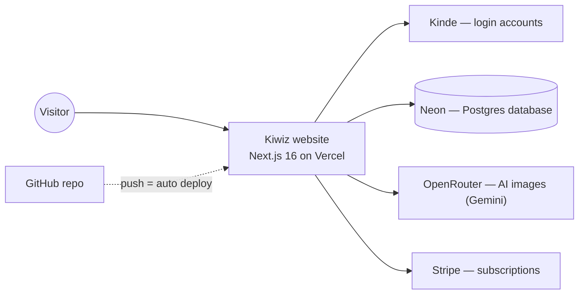

# Kiwiz — Project Documentation

> AI coloring pages & tracing worksheets for kids.
> Full-codebase audit and documentation, written 2026-07-24. Simple language on purpose.

---

## 1. What is this app?

**Kiwiz** is a website for parents, teachers, and therapists. You type an idea — like *"a kite flying in the sky"* — and AI draws either:

- a **coloring page** (black-and-white line art for kids to color with crayons), or
- a **tracing worksheet** (dotted letters, numbers, or shapes for kids to practice writing).

You then **download or print** the result on A4 paper.

Important: kids do **not** color or trace on the screen. The app only *creates printable pages*. The component named "tracing canvas" is just an image preview.

## 2. How a visitor uses it

```
Open site → "Create" page → type an idea → AI draws it → Download / Print
```

1. **Guest** (not logged in): can try **2 generations** (counted in the browser).
2. **Free account** (login via Kinde): **5 generations per day**.
3. **Paid plans** (Stripe subscriptions): Premium **$9.99/month** (unlimited), Family **$19.90/month**.

Other pages: Home (marketing), Dashboard (your stats and recent activity), Membership (pricing), How to Use, About Us, Contact Us, Parenting Newsletter (email signup), Admin (user management + stats, for admin accounts only).

## 3. Architecture — the pieces



| Piece | What it does |
|---|---|
| **Vercel** (hosting) | Runs the site at `ai-coloring-and-tracing-ruby.vercel.app`. Every push to GitHub `main` deploys automatically. |
| **Neon** (database) | Postgres database `printables` (AWS us-east-2). Stores users, plans, generation counts, activity log, newsletter emails. |
| **Kinde** (login) | Handles sign-up/sign-in at `aiprintables.kinde.com`. The app never sees passwords. Admin = `isAdmin` flag in the database. |
| **OpenRouter** (AI) | The AI service that draws images. The code tries models in order: `google/gemini-2.5-flash-image-preview` → `google/gemini-2.0-flash-exp` → `anthropic/claude-3.5-sonnet`, with a text-only fallback. |
| **Stripe** (payments) | Subscription checkout for the paid plans. |

### Tech stack

Next.js 16 (App Router, Turbopack) · React 18 · TypeScript · Tailwind CSS 4 · Prisma 6 + PostgreSQL · Kinde auth · Stripe · OpenRouter via the OpenAI SDK · next-intl (EN/FR/ES/DE, client-side only) · pnpm.

## 4. Folder map

```
app/               Pages and API routes
  create/          The main "type an idea" screen (coloring + tracing tabs)
  dashboard/       Logged-in user's stats page
  membership/      Pricing page
  admin/           Admin dashboard, user CRUD, newsletter export
  api/             Server endpoints:
    generate-coloring/   AI coloring generation (guests allowed)
    generate-tracing/    AI tracing generation (guests get placeholder only)
    checkout/            Creates the Stripe payment page
    user/me/             Current user profile + remaining credits
    analytics/           Dashboard stats + activity tracking
    newsletter/subscribe/  Saves newsletter emails
    auth/[kindeAuth]/    Kinde login/logout/callback
components/        Screens and UI pieces (coloring-page, tracing-page, header, …)
lib/               Logic: AI calls, usage limits, print/download-to-A4, admin check
prisma/            Database shape (schema.prisma) + 5 migrations
locales/           Translations: en, fr, es, de
proxy.ts           Middleware: which pages need login, admin gate
public/            Images
```

Database tables: **User** (account, plan, counts, isAdmin, Stripe IDs), **Activity** (one row per generation), **NewsletterSubscriber** (emails). Plan enum: `FREE | PREMIUM`.

## 5. Running it on your computer

```bash
pnpm install     # installs everything + generates the Prisma client
pnpm dev         # starts the site at http://localhost:3000
```

You need a `.env` file in the project root (never commit it — it's git-ignored). See the table in section 6 for what goes in it.

**Caution:** the local `.env` currently points at the **production** database and the **production** login URL. Anything you test locally changes real customer data, and clicking Login locally sends you to the live site. For safe development, create a second (dev) database in Neon and set `KINDE_SITE_URL=http://localhost:3000` locally (plus matching callback URLs in the Kinde dashboard).

## 6. Environment variables (names only — values are secret)

Set these in `.env` locally and in **Vercel → Project → Settings → Environment Variables** for the live site.

| Key | What it's for |
|---|---|
| `DATABASE_URL` | Address + password of the Neon Postgres database |
| `OPENROUTER_API_KEY` | Pays for AI image generation (from openrouter.ai → Keys; account needs credits) |
| `KINDE_CLIENT_ID`, `KINDE_CLIENT_SECRET`, `KINDE_ISSUER_URL` | Login app credentials from the Kinde dashboard |
| `KINDE_SITE_URL`, `KINDE_POST_LOGIN_REDIRECT_URL`, `KINDE_POST_LOGOUT_REDIRECT_URL` | Where login redirects go (site URL; localhost for dev) |
| `STRIPE_SECRET_KEY` | Stripe account secret key |
| `STRIPE_BASIC_PRICE_ID`, `STRIPE_PREMIUM_PRICE_ID`, `STRIPE_FAMILY_PRICE_ID` | The three plan prices created in Stripe |
| `NEXT_PUBLIC_APP_URL` | The site's own address (used for Stripe return links) |
| `NEXT_PUBLIC_SITE_URL` | Wanted by SEO/sitemap code — **currently missing**; add it (same value as APP_URL) |
| `NEXT_PUBLIC_WHATSAPP_NUMBER`, `NEXT_PUBLIC_WHATSAPP_DEFAULT_MESSAGE`, `NEXT_PUBLIC_SUPPORT_EMAIL`, `NEXT_PUBLIC_EMAIL_SUBJECT`, `NEXT_PUBLIC_EMAIL_BODY` | Contact-page WhatsApp/email buttons (`…DEFAULT_MESSAGE` is referenced by code but not set yet) |
| `RESEND_API_KEY` | Would send emails — currently unused (no email code exists) |
| `OPENROUTER_SITE_URL`, `OPENROUTER_SITE_NAME`, `NEXT_PUBLIC_ADMIN_EMAIL`, `NEXT_PUBLIC_STRIPE_PUBLISHABLE_KEY` | Present but never read by the code — safe to delete |

## 7. Current status (audit of 2026-07-24)

### Working
- Site loads locally and in production; all pages render.
- Database connected, all 5 migrations applied.
- Login flow and page protection work (`/dashboard`, `/admin` require login; admin additionally requires the database `isAdmin` flag).
- Newsletter signup writes to the database.

### Broken / needs attention (priority order)

1. **AI generation fails for everyone** — the OpenRouter key is invalid (`401 User not found`), confirmed on both localhost and the live site. Fix: create a new key at openrouter.ai (with credits), update `.env` and Vercel, redeploy. This one step revives the core product.
2. **Rotate the database password** — due to an earlier `.env` mix-up the database connection string was being sent to a third-party API. Reset the password in Neon, update `DATABASE_URL` everywhere.
3. **Payments are not verified** — there is no Stripe webhook; `/success` upgrades any logged-in visitor to PREMIUM without checking that a payment happened; checkout doesn't require login and isn't linked to the user; the FAMILY plan can't be stored (enum only has FREE/PREMIUM); choosing "Free" wrongly starts a paid checkout. Fix before promoting paid plans: add a webhook, verify the Stripe `session_id` in `/success`, require login at checkout, extend the Plan enum.
4. **Smaller code bugs**: coloring page's newsletter popup calls `/api/newsletter-subscribe` (doesn't exist; real route is `/api/newsletter/subscribe`); `/contact-us` is missing from the public-paths list in `proxy.ts` so it wrongly requires login; newsletter accepts invalid email strings; `/api/auth/health` publicly prints auth configuration; guest/free limits disagree (2 in the UI, 3/day in-memory on the server, 5/day for free accounts, "5 lifetime" on the pricing page).
5. **Email sending doesn't exist** — `RESEND_API_KEY` is set but the Resend library isn't installed and `app/api/send/route.ts` is empty. The newsletter only collects addresses.
6. **SEO/content honesty pass** — metadata contains placeholder domains (`yourdomain.com`), fabricated ratings (4.9★/10,000), an invented team, ₹ prices contradicting the $ prices on the pricing page, OG images that don't exist, and a sitemap advertising `/fr` `/es` `/de` routes that 404. FR/ES/DE translations are each missing 28 keys; several screens hardcode English.
7. **Dead code / polish** — unused `MainApp` and `UpgradeModal` components, mic buttons with no function, orphaned `/cancel` page, missing favicon, `typescript.ignoreBuildErrors: true` hides type errors.

## 8. Fix roadmap (suggested order)

1. New OpenRouter key → Vercel + `.env` → redeploy → verify generation works.
2. Rotate Neon password → update `DATABASE_URL`.
3. Payment hardening: webhook + verified `/success` + authenticated checkout + FAMILY enum.
4. One-line fixes: newsletter URL, contact-us public, email validation, remove auth/health, unify limits, add `NEXT_PUBLIC_SITE_URL`.
5. Separate dev environment (dev database + localhost Kinde URLs).
6. Content cleanup: real SEO data, finish translations, remove dead code, add favicon.
